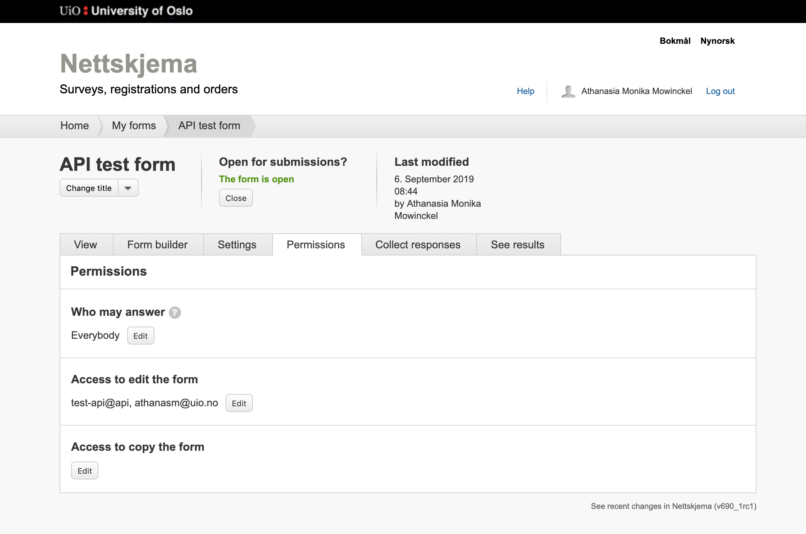

```{r, include = FALSE}
knitr::opts_chunk$set(
  collapse = TRUE,
  comment = "#>"
)
```

```{r setup}
library(nettskjemar)
```

Once you have [set up your API user and access token](), you need to also add your API user to the list of people that may access the form. 
To do this, copy your API user name (i.e. `username@api`) and go to the form you would like to access in the Nettskjema portal.
In the permissions (rettigheter) tab in the form, ass your user to the `Access to edit the form` field.


Once this has been applied, your API user may access the form. 
Please notice that the api-user is handled differently than your standard UiO user, and you will have to do this with **every** form you want to access through the API.
Forms that are submitted to TSD are not possible to retrieve through the API, as the data is encrypted, sendt to TSD, then removed from Nettskjema at submission.

Ideallt, this package should also be able to read and sort the `json` files that are decrypted on TSD, but this has yet to be tested and set up.

